# ClsCheckIn

## Intro

&emsp;**ClsCheckIn** is an android application used for checking attendance in a class. The whole application is divided into two parts. One is provided for students. The other one is provided for teachers. For students, they can use it to upload and update their personal information. For teachers, besides uploading and updating their personal information, they can upload and update attendance sheets and obtain the information about class attendance immediately by uploading a picture. If you want to run the android application properly, you should use [ClsCheckIn](./ClsCheckIn), [ClsCheckIn_py](./ClsCheckIn_py) and [ClsCheckIn_server](./ClsCheckIn_server) simultaneously.

## Usage

&emsp;Before you use the android application, you should assign values to **IP** and **PORT**.

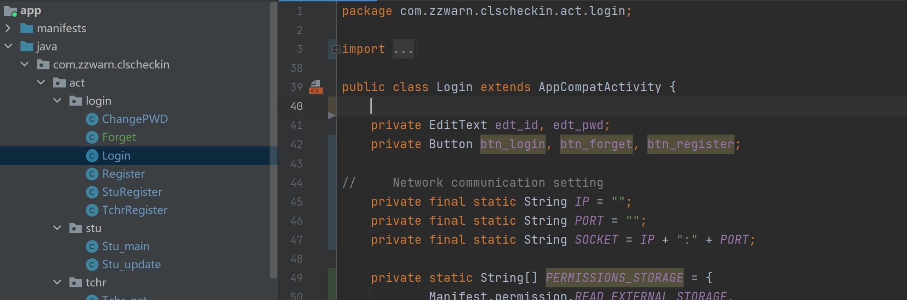

### Login

&emsp;Here is a picture showing the layout of Login interface. If you are new here, click on **REGISTER**  and register a new account. If you have registered an account but you forgot your password unfortunately, click on **FORGET** and reset your password.

&emsp;The following two pictures show some circumstances you may meet.

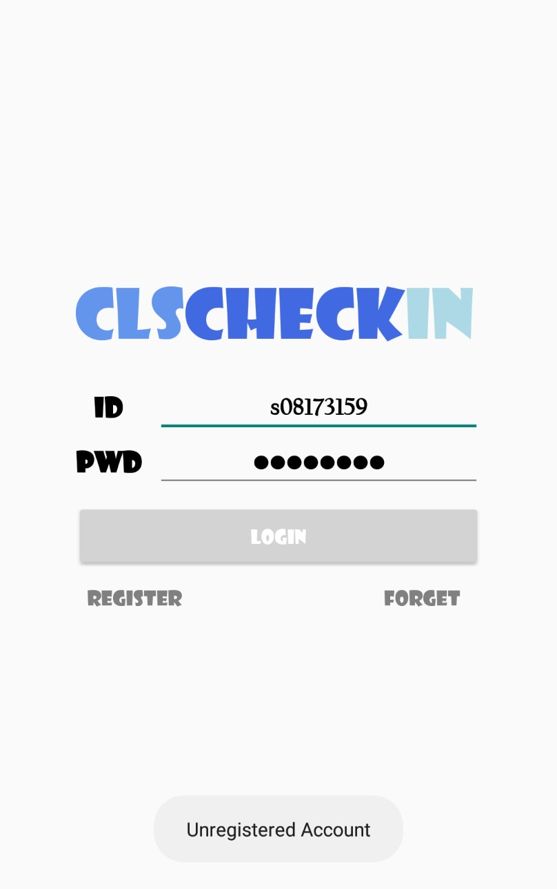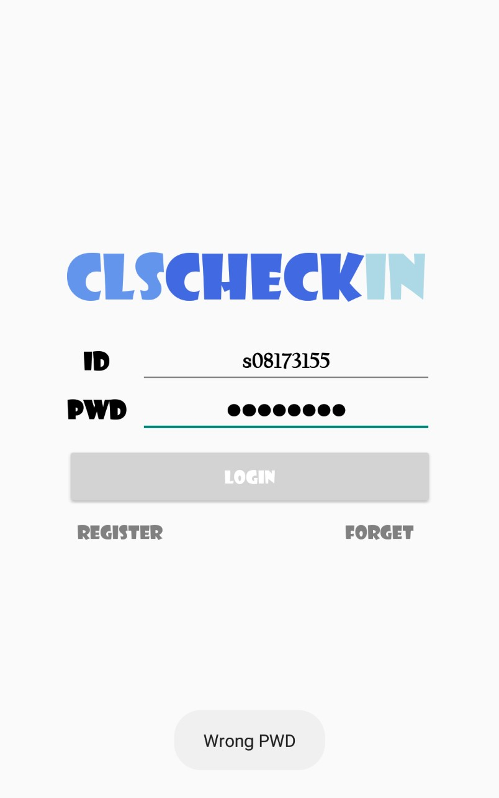

 

### Register

&emsp;The process of register is divided into two sub-processes.

- Firstly, enter your ID, and the server will check if your ID is legal and unregistered. If not, you will not be allowed to register you account. The following pictures show some circumstances you may meet.

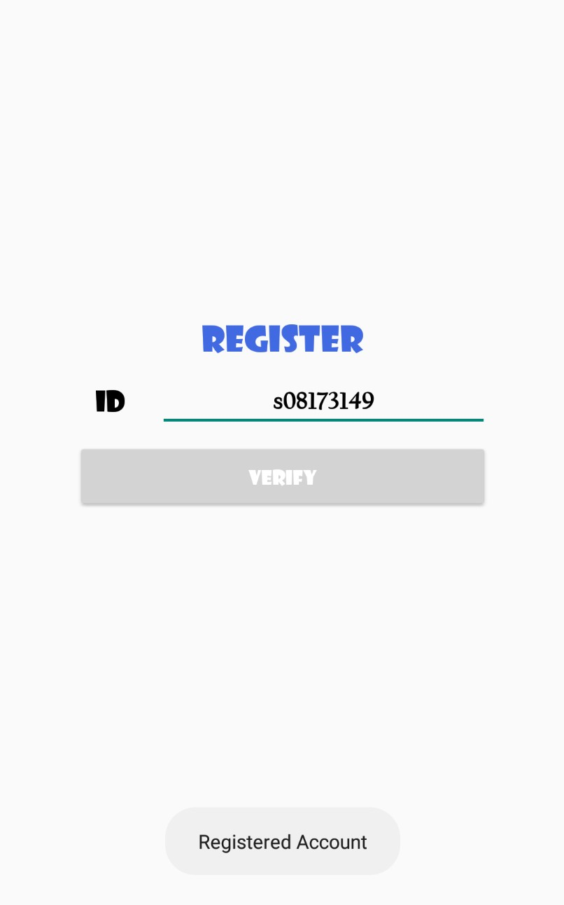

- Secondly, based on your character, you will be guided to different register interface. For example, if you are a student, you will see the register interface shown below.

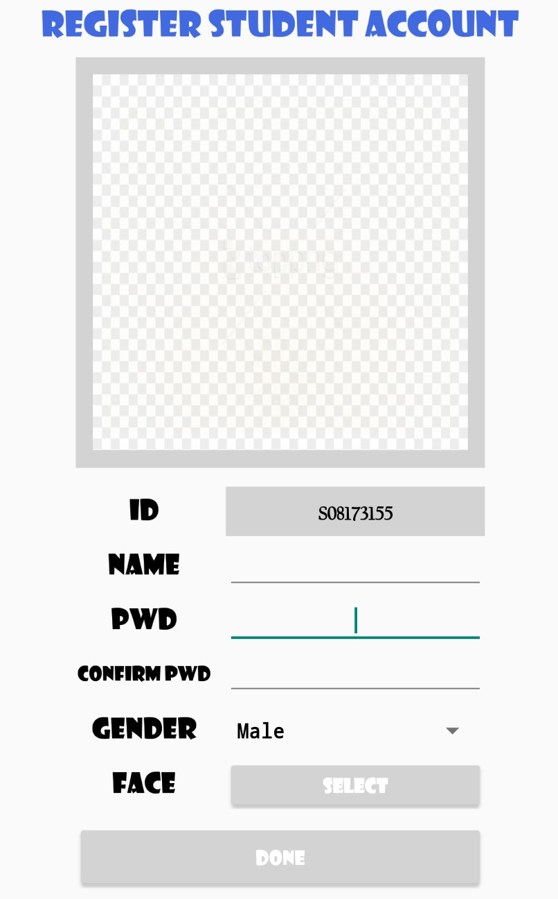

### Forget

&emsp;The process of resetting password is divided into two sub-processes.

- Firstly, enter your **ID** and your **Name**, and the server will verify if your ID matches your Name. If not, you will not be allowed to change your password. The following pictures show some circumstances you may meet.

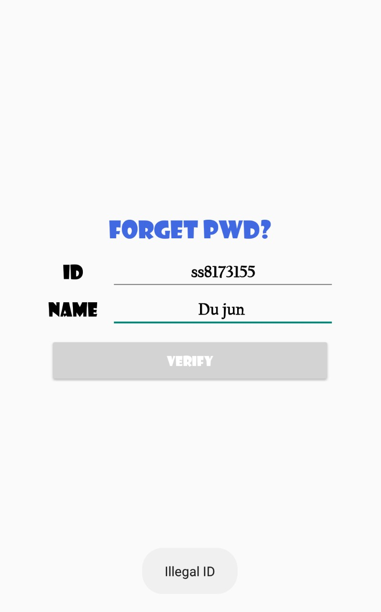

- Secondly, if you pass the verification, you will go to the interface where you can reset you new password.

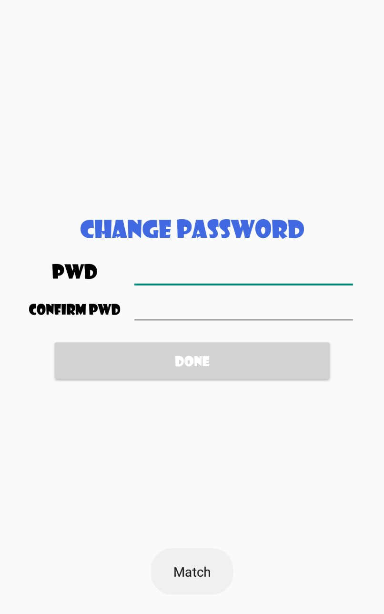

### Teacher

&emsp;If you are a teacher, you will come into the following interface. **Menu icon** is in the left corner of the interface. **Courses drop-down menu** and  **group photo preview stand** are in the middle of the interface. The **floating action button** is in the right bottom of the interface. Now, I will tell you how to use them one by one.

####  Courses drop-down menu

&emsp;When you do not upload any attendance sheet of your courses to the server, the course drop-down menu would not show any item. If you do not know how to upload it, you can go to the section **Menu icon** to get more information. 

&emsp;Assuming that you have uploaded your attendance sheets, you need to refresh your courses drop-down menu. Pull down the interface and wait for server's response! The following GIF shows the process.

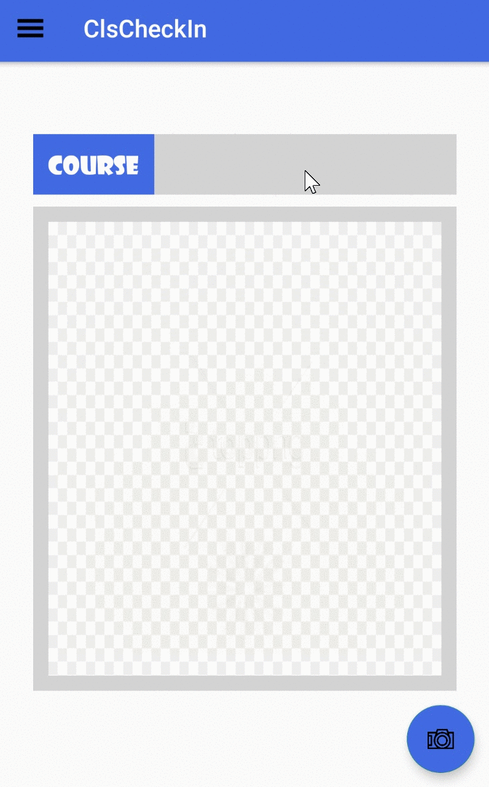

#### Menu icon

&emsp;As it is shown in the following GIF, When you click on the menu icon, the menu will pop out. The menu has 4 options.  

- **Update Personal Info:** Update your personal information.

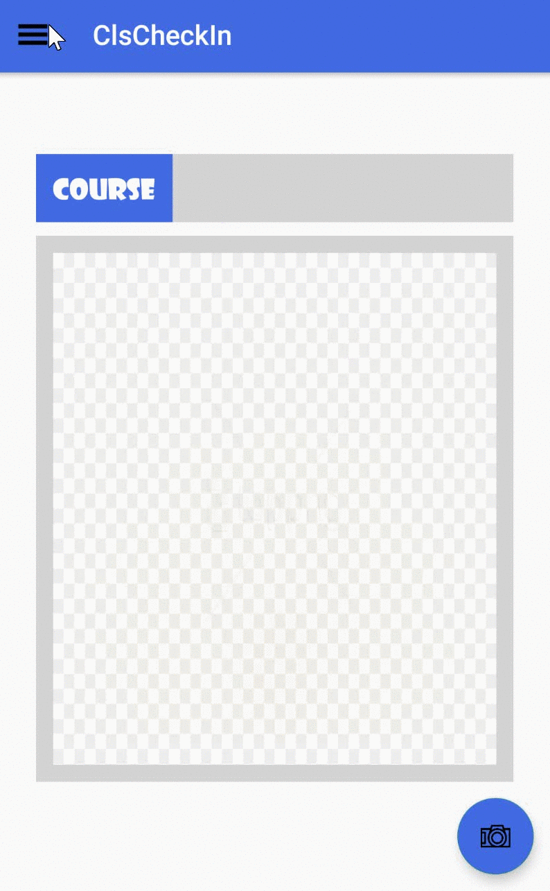

- **Upload Attendance Sheet:** Add or update new course attendance sheets.

- **Get Result:** Get a sheet of absent students after taking a group photo and selecting the course.

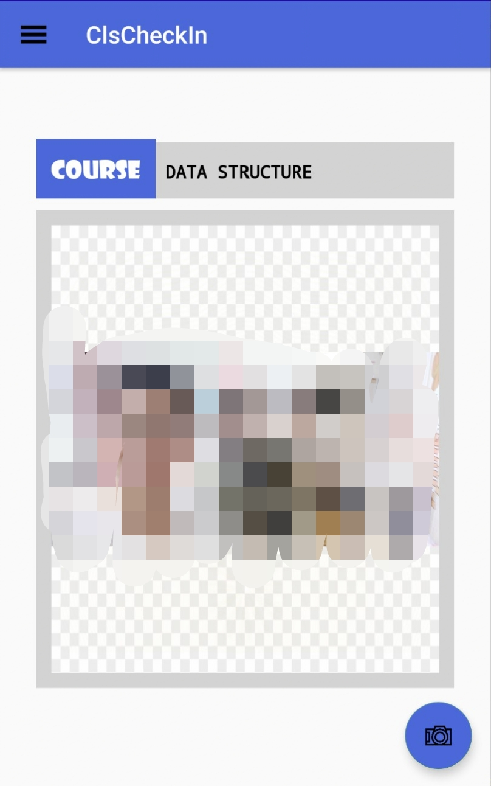

- **Exit:** Log out.

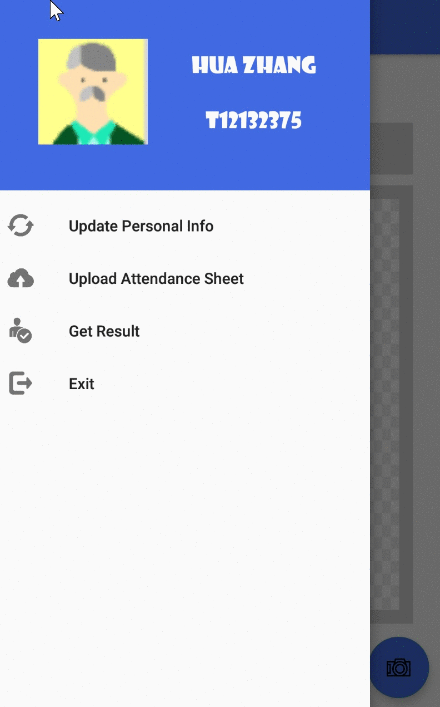

### Student

&emsp;The following picture shows the whole interface of a student's account.

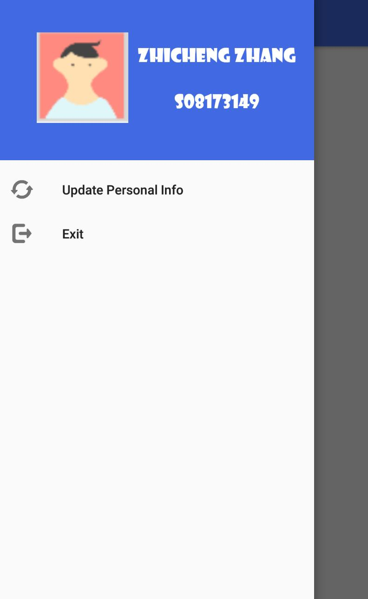

&emsp;Student's menu contains two options, **Update Personal Info** and **Exit**. By touching **Update Personal Info, **students can update or correct their personal information. By touching **Exit**, students can log out.

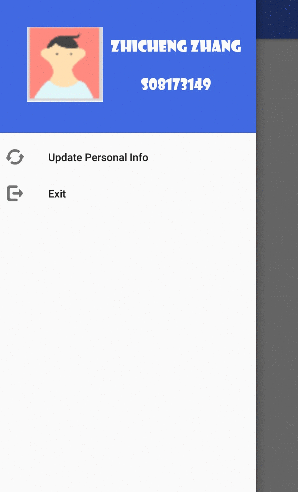

# ClsCheckIn_py

## Intro

&emsp;This is a python project used for updating students' basic information and checking the attendance of a course.

## Note

&emsp;When you install **face_recognition** via pip, and your computer's system is **Windows**, please follow these steps one by one. 

- Firstly, create a virtual environment whose python version is 3.6. Use `conda create -n cls python=3.6` to create it.
- Secondly, activate created virtual environment. Use `conda activate cls`.
- Thirdly, download **cmake** and **boost**. Use following commands one by one.
  `pip install cmake`  
  `pip install boost`
- Fourthly, go to the [website](https://pypi.org/simple/dlib/) and download appropriate whl file. For example, if your computer is 64-bit and your python version is `3.6.X`, you should choose to download [dlib-19.8.1-cp36-cp36m-win_amd64.whl](https://pypi.org/simple/dlib/dlib-19.8.1-cp36-cp36m-win_amd64.whl).  
- Fifthly, use the whl file to install dlib. Run the command `pip install <absolute path of the whl file>` 
- Finally, use the command `pip install face_recognition` to install **face_recognition** successfully.

# ClsCheckIn_server

## Intro

&emsp;This is a project supporting the android application, ClsCheckIn. Before running it, you should create six tables and assign values some parameters shown in [the picture](./img/database_setting.jpg). The structure of our database is shown in [the picture](./img/database.jpg)

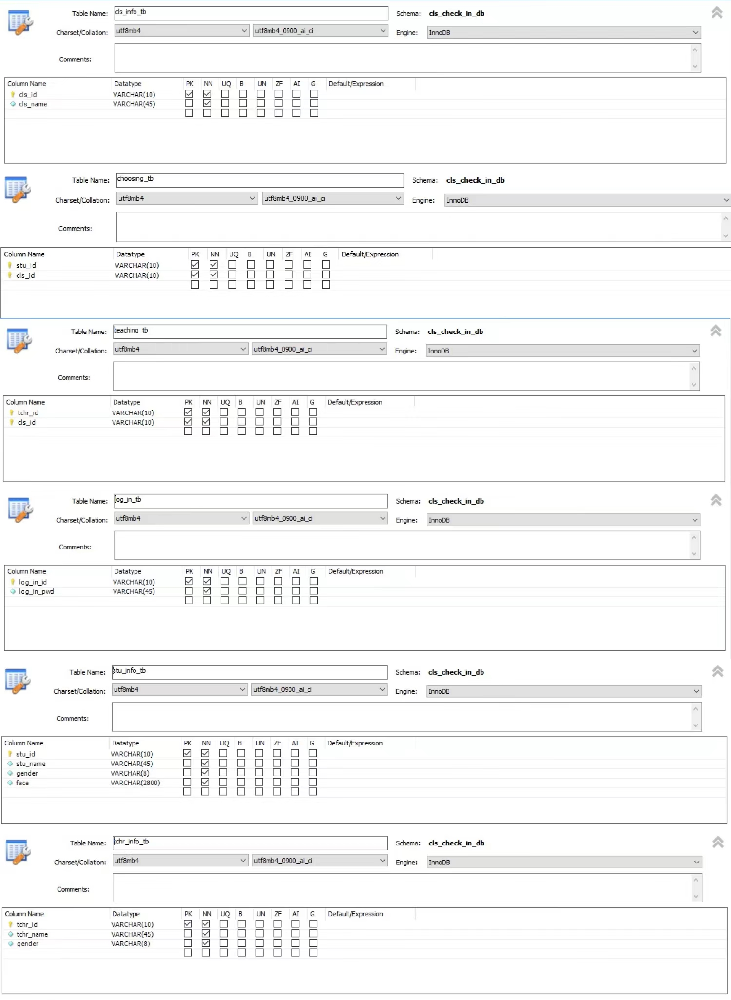

